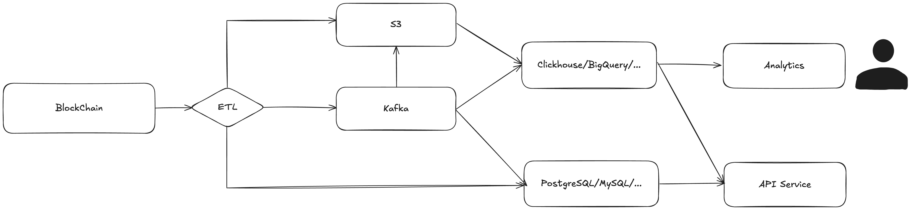

# Why BlockDuck

## Why BlockDuck

DuckDB is an in-process SQL OLAP (Online Analytical Processing) database management system designed for high-performance analytical query processing. It is optimized for fast, interactive query execution on large datasets, and it can operate within the application process, meaning it doesn't require a separate database server or client-server architecture.

BlockDuck is a tool for blockchain data analysis based on DuckDB's flexible extension mechanism. It is designed to perform blockchain data analysis using the power of DuckDB. BlockDuck allows users to query blockchain data in a way that is similar to querying a traditional SQL database, enabling easier and more efficient analysis of blockchain data.

BlockDuck's core design philosophy is: Query Blockchain as a Table.

### **Live SQL Queries on Blockchain**

If we consider the blockchain as a distributed database that achieves consensus through a large number of global nodes, then the blocks, transactions, and contract states running on it can be regarded as a time-series database table that grows over time. However, treating blockchain as a database is just an abstraction. From a functional perspective, blockchain does not provide SQL query capabilities. We can only retrieve data from specific blocks through simple HTTP or WebSockets.

In current blockchain analysis practices, people typically download blockchain data to S3 using tools, and then import the data into data warehouses like BigQuery or Redshift for analysis. This introduces unnecessary operational and service costs, and real-time performance may also be impacted.

BlockDuck provides a capability that allows you to directly query and analyze blocks, transactions, and contract states on the blockchain using DuckDB's PostgreSQL-Compatible SQL syntax, without the need to first download the data from the blockchain and import it into a database before performing SQL analysis. This eliminates the need for time-consuming data extraction, transformation, and loading (ETL) processes.

With BlockDB and DuckDB, you don't even need to install and run a full database instance. You simply need to import the corresponding packages and plugins in languages like Python, and you can perform real-time analysis. Sounds pretty cool, right?

### Data Pipeline

Before introducing BlockDuck, the current blockchain data pipeline is roughly as follows:

<figure><figcaption></figcaption></figure>

After introducing BlockDuck, we can simplify the blockchain data pipeline:

<figure><figcaption></figcaption></figure>

ETL can be handled within BlockDuck using SQL. And also, since DuckDB supports an in-process execution mode, we can also run BlockDuck inside the API service.
