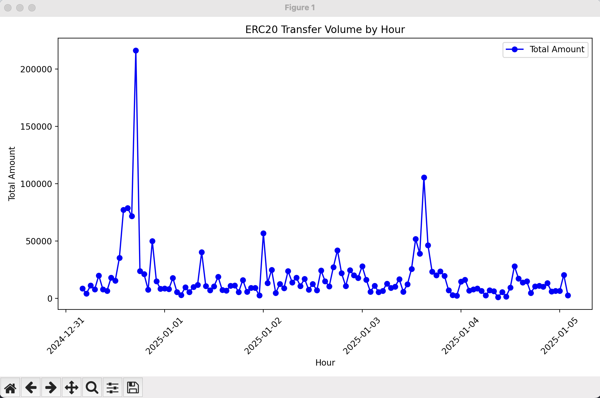

# Hourly ERC20 transfer volumn monitor page

This demo will show you how to build a real-time monitoring chart for the hourly transfer volume changes of Aave ERC20 tokens with about 100 lines of Python code. It will start pulling data from January 1, 2025, and display it in real time.

### Build connection

First, we need to create the connection and set up some basic configurations:

```python
def build_con():
    con = duckdb.connect(database = "file.db", config = {"allow_unsigned_extensions": "true"})
    con.load_extension("./build/release/extension/blockduck/blockduck.duckdb_extension")
    con.execute("set variable eth_url = 'eth/rpc/provider/url';")
    con.execute("pragma blockduck_set_verbose(true);")
    return con
```

1. For now, because BlockDuck isn't signed yet, we need to set `allow_unsigned_extensions` to enable load unsigned extension.
2. set verbose to true, so we can print more execution details.

### Create table

Next, we will create internal tables corresponding to the block table function and the contract table function, which will be used to stream and materialize incremental blockchain data, thereby accelerating query performance.

```python
# init table function and table
def init_table(con, start_block):
    ## create table func
    con.execute("""
            pragma blockduck_create_contract_event_rpc('tranfer_erc20', '{"anonymous":false,"inputs":[{"indexed":true,"internalType":"address","name":"from","type":"address"},{"indexed":true,"internalType":"address","name":"to","type":"address"},{"indexed":false,"internalType":"uint256","name":"amount","type":"uint256"}],"name":"Transfer","type":"event"}');
            """)
    ## create table eth_block if not exists
    con.execute(f"""
    create table if not exists eth_block as 
    select * from eth_blocks_rpc({start_block}, {start_block}, getvariable('eth_url'));
    """)
    ## create table tranfer_erc20 if not exists
    con.execute(f"""
    create table if not exists tranfer_erc20 as 
    select * from eth_contract_event_rpc_tranfer_erc20(['{ERC20_CONTRACT}']::VARCHAR[], {start_block}, {start_block}, getvariable('eth_url'));
    """)
    
    ## check the latest block in eth_block
    latest_block_in_db = con.execute("select max(number) from eth_block").fetchone()[0]
    if latest_block_in_db is not None:
        start_block = latest_block_in_db + 1
    
    return start_block
```

Read the lastest block number to start loading from the previous position.

### Block Materialize

Next, materialize incremental blockchain data into the internal table. Every `BLOCK_PER_QUERY` blocks each time.

```python
# get latest block number
def get_latest_block(con):
    return con.execute("select * from eth_latest_block_rpc(getvariable('eth_url'))").fetchall()[0][0]

# materialize block and erc20 transfer event from start_block to latest block
def execute_materialize(start_block, con):
    latest_block = get_latest_block(con)
    while True:
        end_block = start_block + BLOCK_PER_QUERY - 1
        if end_block > latest_block:
            latest_block = get_latest_block(con)
            if start_block > latest_block:
                print(f"No new block found, latest block is {latest_block}")
                time.sleep(RPC_INTERNAL)
                continue
            else:
                end_block = latest_block

        con.execute("BEGIN TRANSACTION")
        con.execute(f"""
        insert into eth_block 
        select * from eth_blocks_rpc({start_block}, {end_block}, getvariable('eth_url'));
        """)
        con.execute(f"""
        insert into tranfer_erc20
        select * from eth_contract_event_rpc_tranfer_erc20(['{ERC20_CONTRACT}']::VARCHAR[], {start_block}, {end_block}, getvariable('eth_url'));
        """)
        con.execute("COMMIT")
        
        print(f"Materialize block from {start_block} to {end_block} finish")
        
        # notify data update
        data_queue.put(True)

        time.sleep(1)
        start_block = end_block + 1
```

1. We use transaction to make sure insert into `eth_block` and `tranfer_erc20` is atomic.
2. If we already catch up the latest block, sleep `RPC_INTERNAL` seconds and retry later.

### Draw Chart

We join and aggregate these two tables to calculate the transfer amount per hour:

```sql
select date_trunc('hour', timestamp) as hour, sum(amount) as total_amount
            from eth_block
            join tranfer_erc20
            on eth_block.number = tranfer_erc20.blockNumber
            group by hour order by hour
```

And then draw them in that chart.

```python
def update_chart(frame):
    con = build_con()

    if not data_queue.empty():
        data_queue.get()
        sql_query = """
            select date_trunc('hour', timestamp) as hour, sum(amount) as total_amount
            from eth_block
            join tranfer_erc20
            on eth_block.number = tranfer_erc20.blockNumber
            group by hour order by hour
        """
        new_data = con.execute(sql_query).fetchdf()

        if not new_data.empty:
            df = pd.DataFrame(new_data)
            ax.clear()
            ax.plot(df['hour'], df['total_amount'] / (10 ** 18), marker='o', linestyle='-', color='b', label='Total Amount')
            ax.set_title('ERC20 Transfer Volume by Hour')
            ax.set_xlabel('Hour')
            ax.set_ylabel('Total Amount')
            plt.xticks(rotation=45)
            ax.legend()
            plt.tight_layout()
```

### Result

Finally, let's assemble them together!

And here is the result chart:


<figure><figcaption></figcaption></figure>

### Full Code

```python
import threading
import time
import duckdb
import matplotlib.pyplot as plt
import pandas as pd
from matplotlib.animation import FuncAnimation
from duckdb.typing import *
from queue import Queue

RPC_INTERNAL = 12 # 12s
BLOCK_PER_QUERY = 300 # 300 blocks per query
ERC20_CONTRACT = "0x7Fc66500c84A76Ad7e9c93437bFc5Ac33E2DDaE9" # aave
FROM_BLOCK = 21520000

# init queue
data_queue = Queue()

# build connection
def build_con():
    con = duckdb.connect(database = "file.db", config = {"allow_unsigned_extensions": "true"})
    con.load_extension("./build/release/extension/blockduck/blockduck.duckdb_extension")
    con.execute("set variable eth_url = 'https://eth-mainnet.g.alchemy.com/v2/_VAP1LMRwnhUbKarsWEtC_nYZk-yHPEm';")
    con.execute("pragma blockduck_set_verbose(true);")
    return con

# init table function and table
def init_table(con, start_block):
    ## create table func
    con.execute("""
            pragma blockduck_create_contract_event_rpc('tranfer_erc20', '{"anonymous":false,"inputs":[{"indexed":true,"internalType":"address","name":"from","type":"address"},{"indexed":true,"internalType":"address","name":"to","type":"address"},{"indexed":false,"internalType":"uint256","name":"amount","type":"uint256"}],"name":"Transfer","type":"event"}');
            """)
    ## create table eth_block if not exists
    con.execute(f"""
    create table if not exists eth_block as 
    select * from eth_blocks_rpc({start_block}, {start_block}, getvariable('eth_url'));
    """)
    ## create table tranfer_erc20 if not exists
    con.execute(f"""
    create table if not exists tranfer_erc20 as 
    select * from eth_contract_event_rpc_tranfer_erc20(['{ERC20_CONTRACT}']::VARCHAR[], {start_block}, {start_block}, getvariable('eth_url'));
    """)
    
    ## check the latest block in eth_block
    latest_block_in_db = con.execute("select max(number) from eth_block").fetchone()[0]
    if latest_block_in_db is not None:
        start_block = latest_block_in_db + 1
    
    return start_block

# get latest block number
def get_latest_block(con):
    return con.execute("select * from eth_latest_block_rpc(getvariable('eth_url'))").fetchall()[0][0]

# materialize block and erc20 transfer event from start_block to latest block
def execute_materialize(start_block, con):
    latest_block = get_latest_block(con)
    while True:
        end_block = start_block + BLOCK_PER_QUERY - 1
        if end_block > latest_block:
            latest_block = get_latest_block(con)
            if start_block > latest_block:
                print(f"No new block found, latest block is {latest_block}")
                time.sleep(RPC_INTERNAL)
                continue
            else:
                end_block = latest_block

        con.execute("BEGIN TRANSACTION")
        con.execute(f"""
        insert into eth_block 
        select * from eth_blocks_rpc({start_block}, {end_block}, getvariable('eth_url'));
        """)
        con.execute(f"""
        insert into tranfer_erc20
        select * from eth_contract_event_rpc_tranfer_erc20(['{ERC20_CONTRACT}']::VARCHAR[], {start_block}, {end_block}, getvariable('eth_url'));
        """)
        con.execute("COMMIT")
        
        print(f"Materialize block from {start_block} to {end_block} finish")
        
        # notify data update
        data_queue.put(True)

        time.sleep(1)
        start_block = end_block + 1
    
def update_chart(frame):
    con = build_con()
    if not data_queue.empty():
        data_queue.get()
        sql_query = """
            select date_trunc('hour', timestamp) as hour, sum(amount) as total_amount
            from eth_block
            join tranfer_erc20
            on eth_block.number = tranfer_erc20.blockNumber
            group by hour order by hour
        """
        new_data = con.execute(sql_query).fetchdf()

        if not new_data.empty:
            df = pd.DataFrame(new_data)
            ax.clear()
            ax.plot(df['hour'], df['total_amount'] / (10 ** 18), marker='o', linestyle='-', color='b', label='Total Amount')
            ax.set_title('ERC20 Transfer Volume by Hour')
            ax.set_xlabel('Hour')
            ax.set_ylabel('Total Amount')
            plt.xticks(rotation=45)
            ax.legend()
            plt.tight_layout()

# main function
if __name__ == "__main__":
    con = build_con()
    print("Connection created successfully")
    # build table function for eth block and erc20 transfer
    start_block = init_table(con, FROM_BLOCK)
    print("Table function created successfully")
    # run background thread
    background_thread = threading.Thread(target=execute_materialize, args=(start_block, con,))
    background_thread.daemon = True
    background_thread.start()
    data_queue.put(True)

    # plot chart
    fig, ax = plt.subplots(figsize=(10, 6))
    ani = FuncAnimation(fig, update_chart, interval=1000)
    plt.show()
```
